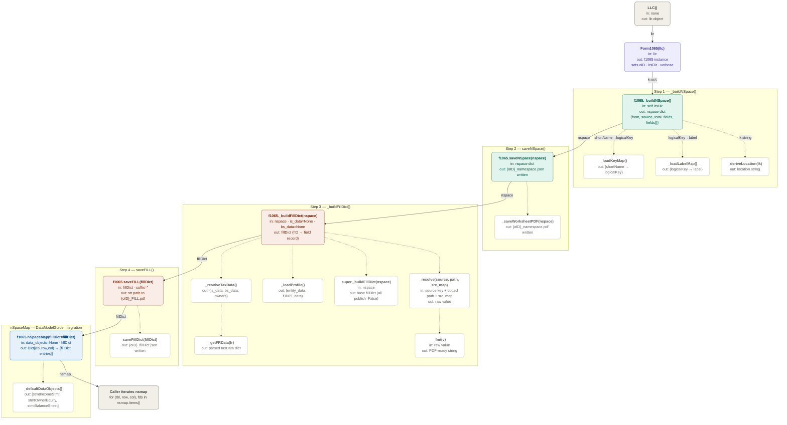
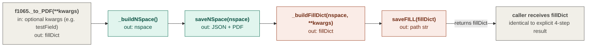
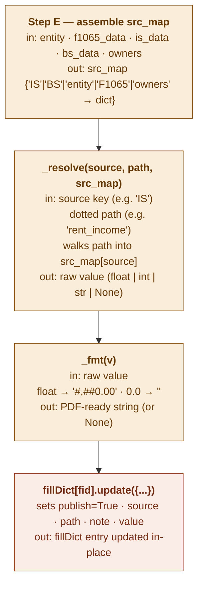

# IRS Form Services — API Reference

**Last updated:** 2026-04-22  
**Source modules:** `irsNspace.py`, `irsForm.py`, `Form1065.py`

---

## Overview

These three modules form a layered stack for generating filled IRS PDF forms from LLC financial data.

```
Form1065          ← form-specific logic (Form1065.py)
    └── irsForm   ← abstract base for all IRS forms (irsForm.py)
            └── irsNspace ← standalone namespace/worksheet generator (irsNspace.py)
```

The standard 4-step workflow applies to every form:

```python
nspace   = form._buildNSpace()       # Step 1 — discover AcroForm fields
form.saveNSpace(nspace)              # Step 2 — save namespace JSON + worksheet PDF
fillDict = form._buildFillDict(nspace)  # Step 3 — assign publish flags + resolve values
form.saveFILL(fillDict)              # Step 4 — write FILL.pdf + fillDict JSON
```

---

## Module 1: `irsNspace.py` — Standalone Namespace Generator

**Class:** `irsNspace(irsForm)`

A standalone utility that reads an IRS AcroForm PDF template and produces a namespace JSON file plus a worksheet PDF. Intended for initial field discovery before a form-specific subclass is built.

### Constructor

```python
irsNspace(form_filename, form_name=None, verbose=True)
```

| Parameter | Type | Description |
|---|---|---|
| `form_filename` | `str` | Filename of the IRS template PDF, e.g. `Form1065_IRS.pdf`. Must be in the `Forms_IRS` folder. |
| `form_name` | `str \| None` | Short form name used in fID namespace. Derived from filename if omitted (e.g. `"Form1065"`). |
| `verbose` | `bool` | Print progress messages. Default `True`. |

**Resolved file paths (all relative to `Forms_IRS/`):**

| Attribute | Description |
|---|---|
| `irs_pdf_path` | Input IRS template PDF |
| `keys_pdf_path` | Keys PDF (`<form>-keys.pdf`) — maps short field names to logical keys |
| `fnames_path` | FieldNames JSON (`<form>-FieldNames.json`) — maps logical keys to labels |
| `out_json_path` | Output: `<form_name>_namespace.json` |
| `out_pdf_path` | Output: `<form_name>_namespace.pdf` |

### Public Methods

#### `_load_irs_fields() → Dict[str, Dict]`

Reads all AcroForm fields from the IRS template PDF via `pypdf.PdfReader.get_fields()`.

Returns a dict keyed by the full AcroForm path, each entry containing:

| Key | Type | Description |
|---|---|---|
| `pdfField` | `str` | Full qualified XFA field path |
| `shortName` | `str` | Leaf name without `[n]` index |
| `fType` | `str` | `"text"` / `"box"` / `"image"` / `"container"` |
| `page` | `int` | 1-based page number |
| `checkedValue` | `str` | On-value for box fields (default `"/1"`) |

Field type classification rules:
- `/FT == /Tx` → `"text"`
- `/FT == /Btn` → `"box"`
- `/FT == /Sig` or `"sig"` in name → `"image"`
- No `/FT` with `/Kids` → `"container"` (excluded from fills)

#### `_load_key_map() → Dict[str, str]`

Reads the companion keys PDF to build a map of `shortName → logicalKey` (e.g. `"f1_01" → "P1_Hdr_0"`). Returns an empty dict with a warning if the keys PDF is not found. Values starting with `"/"` (button on-values) are excluded.

#### `_load_label_map() → Dict[str, str]`

Reads `<form>-FieldNames.json` and returns a map of `logicalKey → human label`. Returns an empty dict with a warning if the file is not found.

#### `_build_namespace(irs_fields, key_map, label_map) → (Dict, Dict)`

Assigns sequential `fID` identifiers (`f1`, `f2`, …) to all discovered fields after sorting by `(page, sequence)`. Returns a tuple of:

- `namespace` dict with keys `form`, `source`, `total_fields`, `fields`
- `fid_to_pdf` dict mapping `fID → raw field info` (used for PDF filling)

Each entry in `namespace["fields"]` contains:

| Key | Description |
|---|---|
| `fID` | Sequential identifier, e.g. `"f42"` |
| `pdfField` | Full AcroForm path |
| `shortName` | Leaf name without index |
| `logicalKey` | Human key, e.g. `"P1_1a"` |
| `label` | Human description |
| `fType` | `"text"` / `"box"` / `"image"` / `"container"` |
| `page` | 1-based page number |
| `location` | Namespace section, e.g. `"Form1065.Pg1.Income"` |

#### `_save_json(namespace) → None`

Serialises the namespace dict to `<form_name>_namespace.json` with 2-space indentation.

#### `_save_pdf(namespace, fid_to_pdf) → None`

Fills a copy of the IRS PDF template to serve as a visual worksheet:
- **Text fields** → filled with their `fID` string (`"f1"`, `"f2"`, …)
- **Box fields** → filled with their checked on-value (`"/1"` etc.)

Uses `pypdf.PdfWriter`. Box fields are filled one at a time to tolerate the subset that lacks `/AP` entries. Writes to `<form_name>_namespace.pdf`.

### Module-level Helpers

| Function | Description |
|---|---|
| `_derive_location(logical_key)` | Maps a logical key to a namespace section string using `_LOCATION_RULES` |
| `_page_from_path(pdf_field)` | Extracts the 1-based page number from an XFA dotted path |
| `_short_name(pdf_field)` | Returns the leaf segment of an XFA path without the `[n]` index |
| `_sort_key(field_info)` | Returns a sort tuple `(page, seq_pg, prefix, seq_num)` for stable field ordering |

### Location Rules (`_LOCATION_RULES`)

Ordered regex rules that assign a namespace location string to each logical key. First match wins. Covers all Form 1065 sections:

| Pattern | Location |
|---|---|
| `^P1_Hdr` | `Form1065.Pg1.Header` |
| `^P1_Sign` | `Form1065.Pg1.SignHere` |
| `^P1_PP` | `Form1065.Pg1.PaidPreparer` |
| `^P1_[A-K]` | `Form1065.Pg1.EntityInfo` |
| `^P1_(1[a-c]?\|[2-8])$` | `Form1065.Pg1.Income` |
| `^P1_(9\|1[0-9]\|2[0-3]\|16)` | `Form1065.Pg1.Deductions` |
| `^P1_(2[4-9]\|3[0-2])` | `Form1065.Pg1.TaxAndPayments` |
| `^B_PR` | `Form1065.Pg4.PartnerRep` |
| `^B_` | `Form1065.Pg2-3.SchedB` |
| `^K_` | `Form1065.Pg5.SchedK` |
| `^L_ANI` | `Form1065.Pg6.ANI` |
| `^L_` | `Form1065.Pg6.SchedL` |
| `^M1_` | `Form1065.Pg6.SchedM1` |
| `^M2_` | `Form1065.Pg6.SchedM2` |
| *(no match)* | `Form1065.Unknown` |

---

## Module 2: `irsForm.py` — Abstract Base Class

**Class:** `irsForm`

Abstract base class for all IRS form PDF services. Provides the complete 4-step workflow as well as shared helpers for file naming, PDF I/O, data loading, and value resolution. Subclasses override `LOCATION_RULES` and `_buildFillDict()`.

### Constructor

```python
irsForm(llc, **kwargs)
```

| Parameter | Type | Description |
|---|---|---|
| `llc` | `object` | LLC management object exposing `llc.acctDir(dirName='ye')`. Used to resolve `self.irsDir`. |
| `verbose` | `bool` | Keyword argument. Print progress messages. Default `False`. |

**Resolved instance attributes:**

| Attribute | Description |
|---|---|
| `self.oID` | Form identifier — set to the concrete class name (e.g. `"Form1065"`) |
| `self.llc` | The LLC object passed in |
| `self.verbose` | Verbosity flag |
| `self.irsDir` | `Path` to `…/AccountingData/<yr>/YE_Tax_Records/Forms_IRS/` |
| `self._root_dir` | `Path` to the LLC-WB-Group root (4 levels above `irsDir`) |
| `self._accts_dir` | `Path` to `…/AccountingData/Accts/` |

### File-Name Helpers

All output files are written to `self.irsDir`. Filenames follow the convention `{oID}_<suffix>`.

| Method | Returns | Description |
|---|---|---|
| `FN() → str` | Absolute path | IRS blank template: `{oID}_IRS.pdf` |
| `_nspaceFN() → Path` | Path | `{oID}_namespace.json` |
| `_nspacePdfFN() → Path` | Path | `{oID}_namespace.pdf` |
| `_fillDictFN() → Path` | Path | `{oID}_fillDict.json` |
| `_glmapFN() → Path` | Path | Deprecated alias for `_fillDictFN()` |
| `_fillFN(suffix="") → Path` | Path | `{oID}{suffix}_FILL.pdf` |

### Step 1 — Build Namespace

#### `_buildNSpace() → Dict`

Reads the IRS template PDF and discovers all AcroForm fields. Internally calls `_loadKeyMap()` and `_loadLabelMap()` to enrich fields with logical keys and labels.

Returns a namespace dict:

```python
{
  "form": str,           # e.g. "Form1065"
  "source": str,         # source PDF filename
  "total_fields": int,
  "fields": {
    "f1": {
      "fID": str, "pdfField": str, "shortName": str,
      "logicalKey": str, "label": str, "fType": str,
      "page": int, "location": str, "checkedValue": str
    }, …
  }
}
```

Field type classification in this class adds finer `checkBox` / `checkText` distinction to the `irsNspace` `"box"` type:
- `/Btn` fields with `[0]` index → `"checkBox"` (Yes)
- `/Btn` fields with `[1]` index starting with `c` → `"checkText"` (No)

Raises `FileNotFoundError` if the IRS template PDF is not found.

#### `saveNSpace(nSpaceDict) → None`

Saves the namespace to JSON and writes the worksheet PDF. Calls `_saveWorksheetPDF()` internally.

### Step 2 — Build Fill Dict

#### `_buildFillDict(nSpaceDict) → Dict`

Base implementation. Every non-container field from the namespace is included in the returned `fillDict` with `publish=False` and `value=""`. Subclasses override to set publish flags and resolve live values.

Each entry in the returned dict:

| Key | Type | Description |
|---|---|---|
| `fID` | `str` | Sequential field ID |
| `pdfField` | `str` | Full AcroForm path |
| `shortName` | `str` | Leaf name without index |
| `logicalKey` | `str` | Human key (`"P1_1a"` etc.) |
| `label` | `str` | Human description |
| `fType` | `str` | `text` / `checkBox` / `checkText` / `image` |
| `page` | `int` | 1-based page number |
| `location` | `str` | Namespace section |
| `checkedValue` | `str` | On-value for button fields |
| `publish` | `bool \| str` | `True` / `False` / `"CPA:unknown"` |
| `source` | `str \| None` | Data source key |
| `path` | `str \| None` | Dotted key within that source |
| `note` | `str` | Human note or CPA instruction |
| `value` | `str` | Resolved fill value |

#### `saveFillDict(fillDict) → None`

Saves the complete fillDict to `{oID}_fillDict.json`. The file wraps the field dict with a `meta` summary:

```python
{
  "meta": {
    "form": str, "generated": str,   # ISO date
    "total": int, "published": int,
    "cpa_unknown": int, "empty": int
  },
  "fields": { … }
}
```

#### Deprecated Aliases

| Method | Calls |
|---|---|
| `_buildGLMap(nSpaceDict)` | `_buildFillDict(nSpaceDict)` |
| `saveGLMap(glMapDict)` | `saveFillDict(glMapDict)` |
| `_buildFILL(nSpaceDict, **kwargs)` | `_buildFillDict(nSpaceDict)` |

### Step 3 — Write Fill PDF

#### `saveFILL(fillDict, suffix="") → str`

Writes the filled PDF. Only fields where `publish=True` and `value` is non-empty are written. Also automatically calls `saveFillDict()`. Returns the absolute path of the written PDF.

| Parameter | Type | Description |
|---|---|---|
| `fillDict` | `dict` | Complete output of `_buildFillDict()` |
| `suffix` | `str` | Optional filename suffix, e.g. `"_F001"` for per-partner K-1 variants |

Raises `FileNotFoundError` if the IRS template PDF is not found.

### Full Pipeline Helper

#### `_to_PDF(**kwargs) → Dict`

Runs all four steps in sequence (namespace → saveNSpace → fillDict → saveFILL) and returns the fillDict. Accepts `testField` kwarg for single-field verbose tracing.

### Data-Loading Helpers

#### `_loadProfile() → Tuple[Dict, Dict]`

Loads `llcProfile_WBGroupLLC.json` from the LLC root directory. Returns `(entity_data, f1065_data)`. Handles both standard JSON and the concatenated dual-JSON format. Falls back to `({}, {})` if the file is not found.

#### `_loadOwners() → List[Dict]`

Loads `llcOwners_WBGroupLLC.json` from the `Accts` directory. Returns a list of owner dicts, or an empty list if not found.

#### `_loadKeyMap() → Dict[str, str]`

Loads the keys PDF (`{oID}-keys.pdf` or legacy `Form_{formNum}-keys.pdf`) and returns a `shortName → logicalKey` map. Returns `{}` with a warning if not found.

#### `_loadLabelMap() → Dict[str, str]`

Loads `{oID}-FieldNames.json` and returns a `logicalKey → label` map. Returns `{}` with a warning if not found.

### Internal Helpers

| Method | Description |
|---|---|
| `_saveWorksheetPDF(nSpaceDict)` | Fills a worksheet copy of the IRS PDF: text fields get their `fID`, checkboxes are checked |
| `_fmt(v) → Optional[str]` | Formats a raw GL/BS/IS value as a PDF-ready string. Floats → `"#,##0.00"`, zero values → `""` |
| `_resolve(source, path, src_map) → Optional[str]` | Walks a dotted key path within a named source dict and returns `_fmt()`-formatted value |
| `_deriveLocation(logical_key) → str` | Matches `logical_key` against `LOCATION_RULES`; returns `_LOCATION_DEFAULT` if no match |
| `_pageFromPath(pdf_field) → int` | Extracts 1-based page number from an XFA field path *(static)* |
| `_sortKey(field_info) → tuple` | Returns sort tuple `(page, seq_pg, prefix, seq_num)` *(static)* |

### Publish Flags

| Value | Meaning |
|---|---|
| `True` | Field is auto-filled from LLC financial data |
| `"CPA:unknown"` | Field requires CPA / manual review; `value` left blank |
| `False` | Field is not applicable or intentionally blank |

### Field Types (`fType`)

| Value | PDF Type | Notes |
|---|---|---|
| `text` | `/Tx` | Alphanumeric text field |
| `checkBox` | `/Btn [0]` | Standard checkbox (Yes position) |
| `checkText` | `/Btn [1]` | No-answer checkbox |
| `image` | `/Sig` | Signature / image field |
| `container` | *(group node)* | AcroForm group node — excluded from fillDict |

---

## Module 3: `Form1065.py` — IRS Form 1065 Service

**Classes:** `Form1065(irsForm)`, `Form1065Preparer` *(legacy)*

Implements the full 4-step workflow for **IRS Form 1065 (U.S. Return of Partnership Income)**. Provides the form-specific field-to-data mapping (`_FILL_MAP`), CPA notes (`_CPA_NOTES`), location rules, and value resolution from the official `stmtFinancialReport` databases.

### Class: `Form1065(irsForm)`

#### Constructor

```python
Form1065(llc, **kwargs)
```

Inherits all parameters from `irsForm`. Sets `self.oID = "Form1065"`.

The IRS template is resolved as `{irsDir}/Form1065_IRS.pdf`, with fallback to the legacy path `Form_1065-IRS.pdf`.

#### Data Sources

Values are resolved from these sources (never from working EditSessions):

| Source Key | Origin | Content |
|---|---|---|
| `entity` | `llcProfile_WBGroupLLC.json` → `profile["entity"]` | Legal name, EIN, address, date started |
| `F1065` | `llcProfile_WBGroupLLC.json` → `profile["F1065"]` | Tax year, preparer info, PR contact, NAICS code |
| `IS` | `stmtFinancialReport(llc).taxData()` → `td["is_data"]` | Income statement lines |
| `BS` | `stmtFinancialReport(llc).taxData()` → `td["bs_data"]` | Balance sheet lines |
| `owners` | `stmtFinancialReport(llc).taxData()` → `td["owners"]` | Partner count, contributions, distributions |

### Public API

#### `FN() → str`

Returns the absolute path to the IRS blank template. Tries `Form1065_IRS.pdf` first, then falls back to the legacy `Form_1065-IRS.pdf`.

#### `_buildFillDict(nSpaceDict, is_data=None, bs_data=None, **kwargs) → Dict`

Single-pass fill dict builder. Extends the base class implementation across these steps:

| Step | Action |
|---|---|
| A | Base dict — all fields, `publish=False`, `value=""` |
| B | Build reverse index `logicalKey → fID` |
| C | Load official IS / BS / owners from `stmtFinancialReport` (or accept override kwargs for testing) |
| D | Load entity / F1065 profile via `_loadProfile()` |
| E | Assemble `src_map` with all five source dicts |
| F | Apply `_FILL_MAP` — set `publish=True` and resolve value for each mapped field |
| G | Apply `_CPA_NOTES` — set `publish="CPA:unknown"` for fields needing accountant review |
| H | Schedule B No defaults — all Sched B Yes/No questions default to `No` (`publish=True`) |

| Parameter | Type | Description |
|---|---|---|
| `nSpaceDict` | `dict` | Output of `_buildNSpace()` |
| `is_data` | `dict \| None` | Override IS lines (testing only) |
| `bs_data` | `dict \| None` | Override BS lines (testing only) |
| `testField` | `str` | (kwarg) Single fID to trace through each step in verbose mode |

Returns a complete fillDict with all `publish` flags set and all `publish=True` values resolved.

#### `nSpaceMap(data_objects=None, fillDict=None) → Dict`

Aggregates per-data-object `PUBLISH_MAP` payloads into a single map keyed by the DataModelGuide addressing triple `(src_tbl, src_row, src_col)`.

Because multiple form fields may bind to the same data cell, each key maps to a **list** of minimal fillDicts — one per form field that references that cell.

```python
for (tbl, row, col), fds in form.nSpaceMap().items():
    for fd in fds:
        render_row(tbl, row, col, fd)
```

| Parameter | Type | Description |
|---|---|---|
| `data_objects` | `list \| None` | Data objects exposing `to_form_payload(oID)`. Default: constructs the standard IS / OwnerEquity / BS set. |
| `fillDict` | `dict \| None` | Pre-computed fillDict. Pass to avoid repeating PDF I/O. |

Sources merged in order (earlier does **not** get overridden by later):
1. Published cells from stmt/ledger data objects
2. `_CPA_NOTES` → `publish="CPA:unknown"`
3. Legacy `_FILL_MAP` fallback for aggregate keys not yet migrated

Minimal fillDict fields per entry: `formNm`, `logicalKey`, `fID`, `pdfField`, `shortName`, `label`, `fType`, `page`, `location`, `checkedValue`, `publish`, `value`, `raw`, `note`, `src_tbl`, `src_row`, `src_col`.

#### `_defaultDataObjects() → List`

Constructs the default set of stmt data objects used by `nSpaceMap()` when no explicit objects are supplied:

1. `stmtIncomeStmt(llc, view_by="All")`
2. `stmtOwnerEquity(llc)`
3. `stmtBalanceSheet(llc, view_by="All")`

Failures are swallowed (diagnostic print in verbose mode). Returns `[]` if `self.llc` is `None`.

### Tax Data Helpers

#### `_resolveTaxData() → Dict`

Returns IS / BS / owners data from the official `stmtFinancialReport` database. Falls back to empty dicts (with warning) if `self.llc` is `None` or the import fails. Never uses working EditSessions.

Returns: `{ "is_data": dict, "bs_data": dict, "owners": dict }`

#### `_getFRData(fr) → Dict`

Calls `fr.taxData()` and parses the JSON result into `{ is_data, bs_data, owners, meta }`. Returns empty dicts on parse failure.

### Inherited Method Overrides

| Method | Override Behaviour |
|---|---|
| `FN()` | Adds fallback to legacy `Form_1065-IRS.pdf` filename |
| `_loadKeyMap()` | Also searches for `Form_1065-keys.pdf` |
| `_loadLabelMap()` | Also searches for `Form_1065-FieldNames.json` |

### Field Map (`_FILL_MAP`)

The module-level `_FILL_MAP` dict covers all auto-fillable fields on Form 1065. Each entry maps a `logicalKey` to a `{ source, path, note }` spec:

| Form Section | Key Range | Source |
|---|---|---|
| Page 1 Header | `P1_Hdr_0` – `P1_Hdr_9` | `F1065`, `entity` |
| Entity Info (Lines A–K) | `P1_A` – `P1_I` | `F1065`, `entity`, `BS`, `owners` |
| Income (Lines 1a–8) | `P1_1a` – `P1_8` | `IS` |
| Deductions (Lines 9–23) | `P1_9` – `P1_23` | `IS` |
| Paid Preparer | `P1_PP_0` – `P1_PP_6` | `F1065` |
| Partnership Representative | `B_PR_1` – `B_PR_7`, `B_PRDI_1` – `B_PRDI_7` | `F1065` |
| Schedule B | `B_25Fm` | `owners` |
| Schedule K | `K_1`, `K_2`, `K_5`, `K_19a`, `K_20a` | `IS` |
| Schedule L — Assets | `L_1_2` – `L_14_2` | `BS` |
| Schedule L — Liabilities & Capital | `L_15_2` – `L_22_2` | `BS` |
| Schedule M-1 | `M1_1`, `M1_5`, `M1_9` | `IS` |
| Schedule M-2 | `M2_2a`, `M2_3`, `M2_6a`, `M2_8`, `M2_9` | `IS`, `BS`, `owners` |

### CPA Notes (`_CPA_NOTES`)

Fields that require CPA or manual entry receive `publish="CPA:unknown"` and are listed in `_CPA_NOTES`. Examples include returns and allowances (`P1_1b`), guaranteed payments to partners (`P1_10`), Schedule M-1 adjustments, and prior-year capital balances.

### Location Rules (`LOCATION_RULES`)

Identical in coverage to the `irsNspace` module-level rules, but defined as a class attribute and extended with synthesised Schedule B checkbox key support (`^c\d+_\d+_`).

---

### Class: `Form1065Preparer` *(Legacy — Deprecated)*

Legacy class retained for backward compatibility. Maps GL balances to Form 1065 lines without the PDF namespace workflow. **New code should use `Form1065(irsForm)` instead.**

#### Constructor

```python
Form1065Preparer(general_ledger, tax_year=2024, entity_name="LLC Rental Partnership",
                 ein="XX-XXXXXXX", beginning_cash=0.0)
```

| Parameter | Type | Description |
|---|---|---|
| `general_ledger` | `Dict[str, float]` | GL account balances. Keys must be in `KNOWN_ACCOUNTS`. |
| `tax_year` | `int` | Tax year (default `2024`) |
| `entity_name` | `str` | Legal entity name |
| `ein` | `str` | Employer Identification Number |
| `beginning_cash` | `float` | Beginning cash balance |

#### Recognised GL Accounts (`KNOWN_ACCOUNTS`)

`Acct.Asset.Purchase`, `Acct.Cash.Expense`, `Acct.Cash.Income`, `Acct.Cash.Investment`, `Acct.Cash.Misc`, `Acct.Cash.Util`, `Acct.Interest.Income`, `Balance`

#### Methods

##### `_validate_gl() → None`

Validates that all GL keys are in `KNOWN_ACCOUNTS` (prints warning for unknowns) and that all values are numeric (raises `TypeError` otherwise).

##### `compute() → Dict`

Maps GL balances to Form 1065 lines. Returns:

| Key | Form Line | Description |
|---|---|---|
| `line_1a` | 1a | Gross rental receipts (`Acct.Cash.Income`) |
| `line_5` | 5 | Interest income (`Acct.Interest.Income`) |
| `line_7` | 7 | Other income (`Acct.Cash.Misc`) |
| `total_income` | 8 | Sum of 1a + 5 + 7 |
| `line_20` | 20 | Total expenses (`Acct.Cash.Expense` + `Acct.Cash.Util`) |
| `total_deductions` | 22 | Same as `line_20` |
| `ordinary_income` | 23 | `total_income − total_deductions` |

##### `_buildGL2IRSMap(namespace_path=None, output_path=None, verbose=True) → Dict` *(static)*

Deprecated. Reads a namespace JSON and writes a GL map JSON to `Form1065_GLMap.json`. Use `Form1065(irsForm)._buildFillDict(nspace)` instead.

---

## File-Output Summary

| File | Written By | Description |
|---|---|---|
| `{oID}_namespace.json` | `saveNSpace()` | All AcroForm fields with fIDs, logical keys, labels, locations |
| `{oID}_namespace.pdf` | `saveNSpace()` → `_saveWorksheetPDF()` | Worksheet copy of IRS PDF for visual field identification |
| `{oID}_fillDict.json` | `saveFillDict()` (called by `saveFILL()`) | Complete field map with publish flags, sources, and resolved values |
| `{oID}_FILL.pdf` | `saveFILL()` | Final filled PDF ready for review or filing |

---

## Quick-Start Example

```python
from irs.Form1065 import Form1065
from ledger.LLC import LLC

llc   = LLC()
f1065 = Form1065(llc=llc)

# Step 1 & 2 — Discover fields and save namespace
nspace = f1065._buildNSpace()
f1065.saveNSpace(nspace)

# Step 3 & 4 — Resolve values and write filled PDF
fillDict = f1065._buildFillDict(nspace)
f1065.saveFILL(fillDict)

# Alternative: run all four steps in one call
fillDict = f1065._to_PDF()

# DataModelGuide integration
nsmap = f1065.nSpaceMap(fillDict=fillDict)
for (tbl, row, col), entries in nsmap.items():
    for fd in entries:
        print(fd["logicalKey"], fd["value"])
```

---

## Program Flowcharts — Quick-Start Call Sequence

The diagrams below trace every function invoked by the Quick-Start Example, showing inputs and outputs at each step. Rendered using [Mermaid](https://mermaid.js.org/) (supported natively in GitHub, GitLab, Obsidian, Notion, and most modern markdown viewers).

### Diagram A — Main call sequence (Steps 1 – 4 + nSpaceMap)



---

### Diagram B — Alternative: `_to_PDF()` one-call shortcut



---

### Diagram C — Value-resolution chain inside `_buildFillDict`

For every `publish=True` field in `_FILL_MAP`, this sub-chain fires:



---

These diagrams use Mermaid syntax. They render automatically on GitHub, GitLab, Obsidian, and Notion. For other environments 
- install the Mermaid CLI:
    1. run ````npm install -g @mermaid-js/mermaid-cli````
    2. run ````mmdc -i irs_API.md -o irs_API_rendered.pdf````
> **Rendering note:** These diagrams use Mermaid syntax. They render automatically on GitHub, GitLab, Obsidian, and Notion. For other environments install the [Mermaid CLI](https://github.com/mermaid-js/mermaid-cli): `npm install -g @mermaid-js/mermaid-cli` then run `mmdc -i irs_API.md -o irs_API_rendered.pdf`.